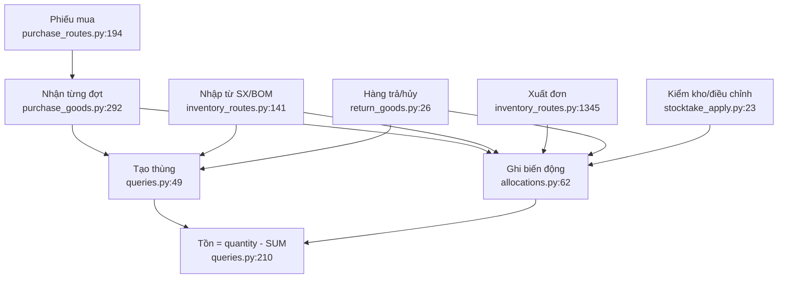

# Bản đồ tính năng nhập hàng và kho

Phạm vi audit: hệ thống mua hàng từ nhà cung cấp, nhận hàng vào kho, kho thùng,
sản xuất/BOM, xuất đơn, hàng trả/xuất huỷ, kiểm kho/điều chỉnh và các read model
liên quan. Không bao gồm các module Telegram/đơn hàng không chạm tới kho.

## Ranh giới tính năng

| # | Tính năng | Entry point chính | Lõi | Mục đích |
|---|---|---|---|---|
| 1 | Phiếu mua, NCC, thanh toán | `server_app/purchase_routes.py:141`, `:194`, `:242`, `:293` | `purchase_store/__init__.py`, `payments.py` | Lưu phiếu thương mại, NCC, giá và các lần trả tiền |
| 2 | Nhận hàng NCC | `server_app/purchase_goods_routes.py:78`, `:117`, `:154`, `:235` | `server_app/purchase_goods.py:122-507` | Nhập nhiều đợt, tạo/cộng thùng, gỡ, chốt và huỷ chốt |
| 3 | Kho lõi | `server_app/inventory_routes.py:444-1300` | `inventory_store/schema.py`, `queries.py`, `allocations.py` | Thùng vật lý, vị trí, đơn vị chứa và tồn hiện tại |
| 4 | Nhập từ sản xuất/BOM | `server_app/inventory_routes.py:141-337` | `add_boxes`, `allocate_picks(kind="production")`, `recipe_store` | Tạo thành phẩm và tiêu hao nguyên liệu |
| 5 | Xuất cho đơn | `server_app/inventory_routes.py:1327-1456` | `allocate_picks`, `delete_allocation`, `order_stock_lock.py:47-144` | Pick một phần thùng, thu hồi và chốt xuất |
| 6 | Di chuyển kho/thùng | `server_app/inventory_routes.py:907-1164` | `inventory_store/allocations.py:203-257`, `queries.py:313-332` | Chuyển hàng giữa thùng hoặc đổi vị trí |
| 7 | Hàng trả/xuất huỷ | `server_app/return_goods.py:26-119`, `server_app/disposal_routes.py:66-159` | `disposal_store`, `receive_return_stock` | Nhập lại, tạo thùng mới hoặc huỷ hàng |
| 8 | Kiểm kho/điều chỉnh | `server_app/stocktake_routes.py:37-356`, `adjustment_routes.py:41-131` | `stocktakes.py`, `stocktake_apply.py`, `adjustments.py` | Chụp sổ, đếm thực tế và áp chênh lệch |
| 9 | Quan sát/phân tích | `server_app/stock_demand.py`, `inventory_store/aux_loss.py`, các timeline | `KhoBoxes.tsx`, timeline/read models | Dashboard tồn, nhu cầu, hao hụt và lịch sử |

## Trục dữ liệu chung

Tất cả luồng kho hội tụ vào hai bảng:

- `inventory_boxes`: một dòng là một thùng vật lý (`inventory_store/schema.py:12-29`).
- `box_allocations`: một dòng là một biến động trên thùng
  (`inventory_store/allocations.py:18-37`). Tồn được tính bằng
  `quantity - SUM(allocation.quantity)` (`inventory_store/queries.py:210-239`).

Các `kind` hiện có: `order`, `production`, `transfer_out`, `transfer_in`,
`purchase_in`, `return_in`, `disposal`, `adjustment`. Dòng dương làm giảm tồn;
dòng âm làm tăng tồn (`inventory_store/allocations.py:203-290`,
`inventory_store/adjustments.py:59-92`).

## Ghi chú phạm vi

Confidence về ranh giới: **0,93**. Chưa đọc sâu toàn bộ format audit/media và
dữ liệu production; các luồng ghi kho, trạng thái phiếu và UI chính đã được lần
theo đến store.
