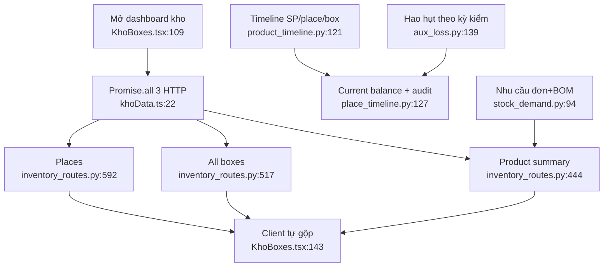

# Dashboard, timeline, nhu cầu và hao hụt

- Dashboard lấy ba snapshot độc lập nên có thể lệch thời điểm (`khoData.ts:22-31`).
- Ba timeline lặp action mapping, delta/epoch/box number và phép tính balance
  (`product_timeline.py:21-118`, `place_timeline.py:20-124`,
  `box_timeline.py:19-86`).
- Audit ghi bất đồng bộ sau commit, nên current balance có thể đi trước lịch sử
  (`inventory_audit.py:30-35`, `adjustment_routes.py:68-75`).
- Nhu cầu dùng mốc cố định dù doc nói “từ hôm nay” (`stock_demand.py:1-10,23-39,94-103`).
- Hao hụt quá khứ tính lại theo BOM và vị trí thùng hiện tại
  (`aux_loss.py:60-118`), nên thay đổi master data có thể viết lại lịch sử.

Phụ thuộc: products/orders/recipes/production/stocktakes/audit/media.
Confidence: **0,91**; chưa profile query count thực tế.
