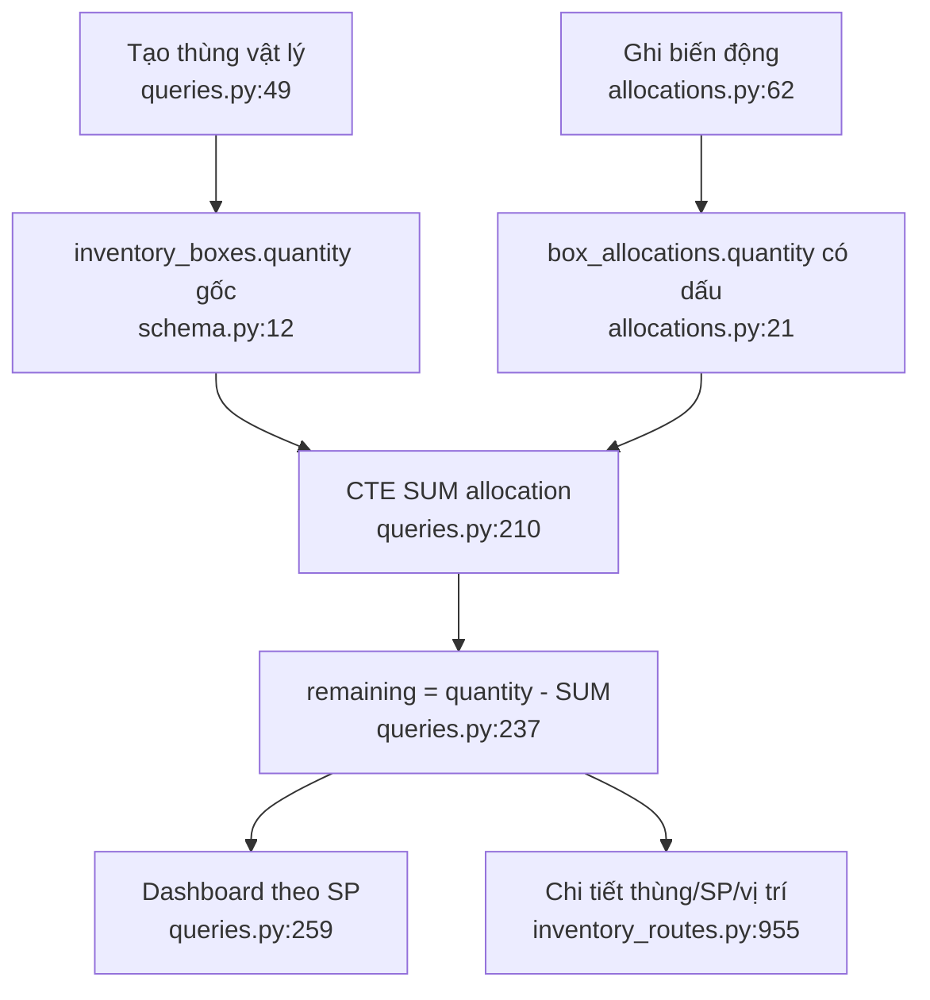

# Kho lõi và phép tính tồn

- `inventory_boxes` giữ danh tính thùng, nguồn, vị trí và số lượng gốc
  (`schema.py:12-29,60-115`).
- Tồn không phải cột lưu sẵn; allocation dương giảm tồn, âm tăng tồn
  (`queries.py:210-243`).
- `box_code` tái sử dụng; `id` mới là danh tính bất biến (`schema.py:32-35`).
- Cùng công thức remaining được viết lại ở allocations, stocktake, purchase,
  timeline và demand thay vì một read model chuẩn.

Phụ thuộc: `products`, `orders`, places, units, audit events. Confidence: **0,96**.

