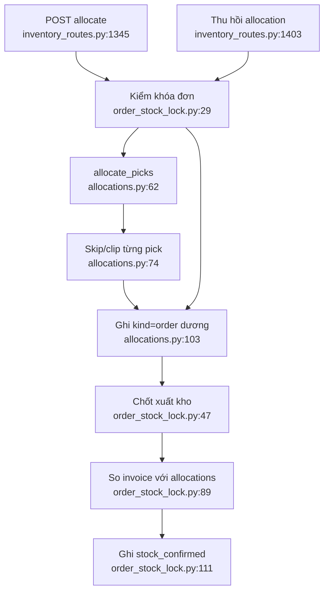

# Xuất kho cho đơn

- Chốt server kiểm cả thiếu lẫn dư (`order_stock_lock.py:89-129`).
- `allocate_picks` bỏ lặng pick sai và clip số vượt tồn; route vẫn có thể trả thành
  công với danh sách rỗng (`allocations.py:74-112`, `inventory_routes.py:1387-1400`).
- Thu hồi kiểm `order_thread_id` nhưng không kiểm `kind='order'`
  (`inventory_routes.py:1434-1439`), là hệ quả nguy hiểm của khóa tham chiếu bị quá tải.

Phụ thuộc: order JSON, inventory, locks, realtime/audit. Confidence: **0,95**.

