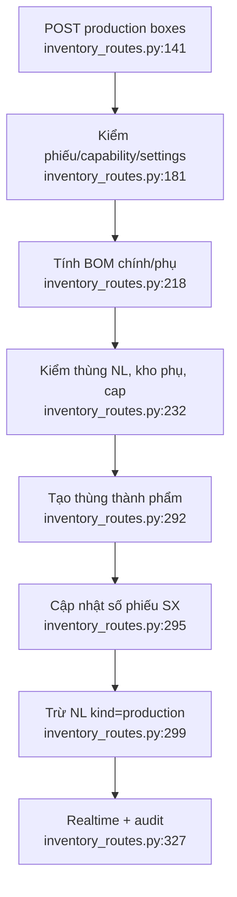

# Nhập kho từ sản xuất và BOM

Nhánh này chứa nhiều rule nghiệp vụ chính đáng: loại phiếu, BOM chính/phụ,
`aux_required`, kho NL phụ và capability sản phẩm (`inventory_routes.py:192-290`).
Tuy nhiên tạo thùng, cập nhật phiếu và trừ NL hiện gọi ba hàm tự quản transaction,
không có một transaction ngoài bao cả chuỗi (`inventory_routes.py:292-300`).

Phụ thuộc: production, product, recipe, settings, inventory, audit/realtime.
Confidence: **0,94**.

