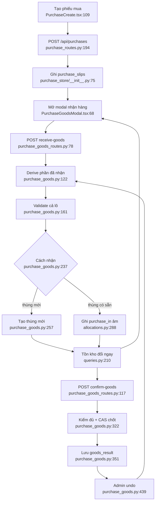

# Phiếu mua và nhận hàng NCC

## Luồng hiện tại

## Side effect và guard

- Tạo/cộng thùng chạy trong transaction của `receive_purchase_lines`
  (`server_app/purchase_goods.py:292-319`).
- Gỡ thùng mới đi qua API xoá thùng tổng quát (`inventory_routes.py:721-828`),
  còn gỡ phần cộng đi qua `unreceive_purchase_line` (`purchase_goods.py:359-393`).
- Chốt chỉ thành công khi mọi mã đủ số lượng và CAS chưa bị request khác giành
  (`purchase_goods.py:322-356`).
- Undo kiểm toàn bộ trước, giữ thùng mới và gỡ `purchase_in`
  (`purchase_goods.py:439-507`).
- Realtime và audit chạy tại route sau mutation
  (`purchase_goods_routes.py:44-75,105-114`).

## Phụ thuộc

`purchase_store`, `product_store`, `inventory_store`, auth role, realtime, audit,
product units và cashbox (với phần thanh toán).

Confidence: **0,94**. Chưa xác minh caller bên ngoài webapp của endpoint legacy
`/handle-goods`.

