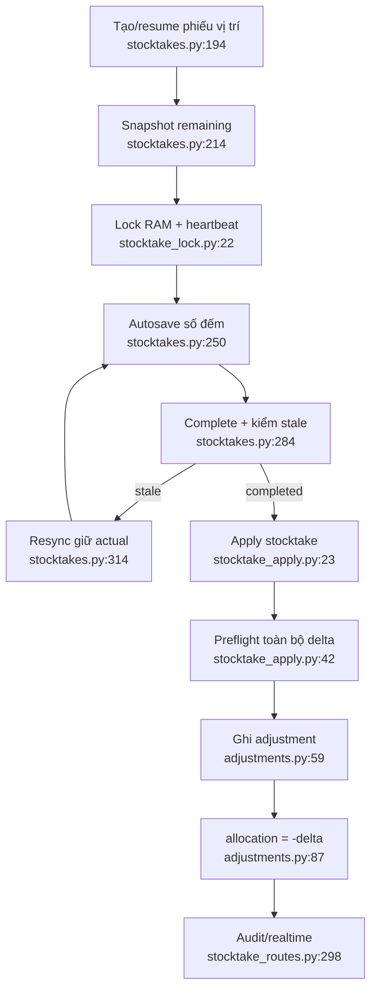

# Kiểm kho và điều chỉnh

- Partial unique index bảo đảm một draft/vị trí (`stocktakes.py:55-59`).
- Lock UI ở RAM process, không bền khi restart/multi-worker (`stocktake_lock.py:6-7`).
- Stale compare lại toàn bộ tập box/remaining mỗi lần đọc draft
  (`stocktakes.py:78-141,144-191`).
- Apply là all-or-nothing và điều chỉnh theo delta snapshot, không ép tồn hiện tại
  về số đã đếm (`stocktake_apply.py:23-69`).
- UI cho admin bấm gỡ cả adjustment từ stocktake, nhưng backend chặn gỡ lẻ
  (`BoxAdjust.tsx:94-118`, `adjustments.py:149-154`).

Phụ thuộc: places, boxes, allocations, adjustment, locks, audit/realtime.
Confidence: **0,93**.

