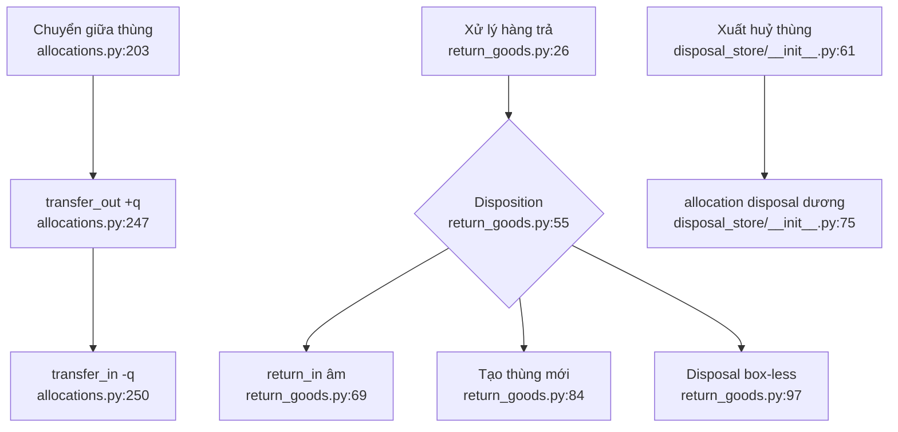

# Chuyển hàng, hàng trả và xuất huỷ

- Transfer là cặp bút toán nguyên tử, nhưng `order_thread_id` chứa ID thùng đối tác
  (`allocations.py:203-257`).
- Hàng trả là một transaction ngoài, nhưng disposition sai bị bỏ lặng và vẫn có thể
  đánh dấu phiếu đã xử lý (`return_goods.py:39-68,109-111`).
- `restock_existing` của hàng trả chưa kiểm cùng sản phẩm, disabled hay trần theo
  phiếu (`return_goods.py:69-83`).
- Xuất huỷ thùng dùng cùng `allocate_picks`, còn hàng trả huỷ dùng phiếu box-less
  để tránh trừ tồn hai lần (`disposal_store/__init__.py:61-130`).

Phụ thuộc: returns, disposal, inventory, realtime/audit. Confidence: **0,92**.
