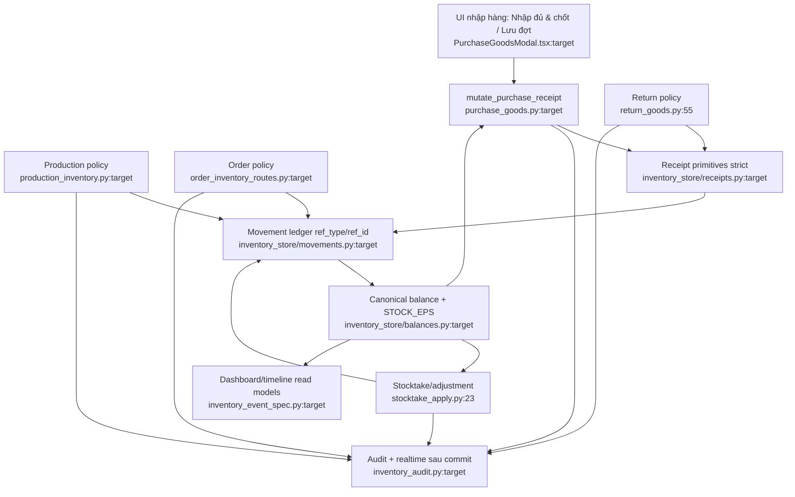

# Đề xuất kiến trúc tối giản

## Kết luận

Nghiệp vụ kho không thừa: theo dõi thùng vật lý, xuất một phần thùng, nhập nhiều
đợt, BOM, kiểm kho và audit đều phục vụ mục đích thật. Phần quá phức tạp nằm ở
cách biểu diễn và orchestration. Có thể giảm đáng kể nhánh code mà không bỏ tính
năng bằng sáu thay đổi dưới đây.

## 1. Một nguồn tính tồn

Tạo `inventory_store/balances.py` với:

- `STOCK_EPS = 1e-6` cho nghiệp vụ;
- một CTE/query chuẩn trả `allocated`, `inflow`, `remaining`, `capacity`;
- `get_box_state(conn, box_id)` cho guard một thùng;
- batch query cho list/product/place/stocktake.

Thay các công thức tại `queries.py:210-310`, `allocations.py:89-102,241-246`,
`purchase_goods.py:94-115,384-495`, `adjustments.py:49-56`,
`stocktakes.py:78-99,214-232` và ba timeline.

Không lưu cột `remaining`; không thêm cache state. Không mất capability.

## 2. Một movement ledger rõ reference và strict mặc định

Giữ một ledger duy nhất. Đổi tên domain từ allocation sang movement:

```text
inventory_movements(box_id, ref_type, ref_id, kind, quantity, at, by)
```

Trong đợt đầu có thể giữ bảng vật lý `box_allocations`, nhưng mọi code mới dùng
`ref_id` thay vì `order_thread_id`. Lõi chỉ cung cấp:

- `issue_stock(...)` — giảm tồn, strict;
- `receive_stock(...)` — tăng tồn, strict;
- `transfer_stock(...)` — cặp movement cùng transaction;
- `reverse_movements(kind, ref_id, ...)` — primitive; policy undo vẫn ở feature.

Các call site `allocations.py:62-290`, `disposal_store:61-90`,
`purchase_goods.py:237-268`, `return_goods.py:69-96`, `adjustments.py:87-92`
chuyển sang lõi này.

Feature vẫn tự kiểm trần purchase, BOM production và invoice order. Hành vi
skip/clip im lặng của `allocate_picks` bị bỏ; batch sai trả lỗi rõ. Mất capability
best-effort, nhưng đây là mất mát chấp nhận được vì tránh thành công một phần.

## 3. Một command cho receipt phiếu mua, một nguồn trạng thái

Thay ba surface `receive-goods`, `confirm-goods`, `handle-goods` bằng một command:

```text
POST /api/purchases/{id}/receipt
{ lines: [...], close: false|true }
```

- `lines + close=false`: lưu một đợt;
- `lines=[] + close=true`: chỉ chốt;
- `lines + close=true`: nhập đủ và chốt trong một transaction.

Entry point duy nhất: `mutate_purchase_receipt()` tại
`server_app/purchase_goods.py` (thay `:292-356,396-436`). Xoá
`apply_purchase_receipt`, route legacy `purchase_goods_routes.py:193-232` và
client legacy `api.ts:444-447`.

Giữ `goods_handled_at/by` làm marker đóng. Luôn derive receipt entries từ
`source_purchase_id` + `purchase_in`; bỏ snapshot `goods_result` và nhánh đọc
`purchase_goods_view.py:37-42`. Audit là lịch sử bất biến.

Mất capability duy nhất: client ngoài đang gọi endpoint legacy và consumer đọc
`goods_result` phải migrate. Chức năng nhập nhiều đợt/chốt/undo vẫn giữ.

## 4. Primitive receipt dùng chung, policy vẫn riêng

Đặt hai primitive thuần tại `inventory_store/receipts.py`:

- `receive_into_existing(source_type, source_id, product_id, box_id, qty)`;
- `receive_as_new_boxes(source_type, source_id, product_id, quantities, ...)`.

Nó chịu trách nhiệm check box tồn tại, enabled, đúng product, quantity và ghi
movement/source. Purchase (`purchase_goods.py:195-268`) giữ cap/chốt; return
(`return_goods.py:55-107`) giữ dispose. Không dựng một framework disposition tổng
quát.

Không mất capability; đồng thời sửa được divergence return nhận vào sai SP hoặc
thùng disabled.

## 5. Một transaction cho nhập từ sản xuất

Tách orchestration `inventory_routes.py:181-309` thành entry point
`create_production_inventory()` tại `server_app/production_inventory.py`:

1. validate slip/product/BOM/picks;
2. mở một transaction;
3. tạo thùng thành phẩm;
4. cập nhật numbers/total phiếu;
5. ghi movements tiêu hao;
6. commit;
7. publish audit/realtime.

Các store con không được bare-commit khi đang nằm trong transaction ngoài.
Không mất capability; loại trạng thái nửa chừng.

## 6. Snapshot/event spec chung, route chỉ orchestration

- Chuyển `box_snapshot` từ `server_app/inventory_audit.py:15-27` xuống
  `inventory_store/snapshots.py`; xoá `_audit_snap` tại
  `purchase_goods.py:102-119`.
- Tạo `server_app/inventory_event_spec.py` chứa action → delta/direction/reason;
  ba timeline chỉ giữ query theo scope.
- Một helper hẹp publish realtime cho `box_ids + entity`, thay fan-out lặp ở
  production/order/purchase/return/disposal/adjustment.

Không tạo event bus, registry hay factory. Không mất capability.

## 7. Dọn cấu trúc và UX sau khi lõi ổn định

### Code

- Chia `inventory_routes.py` 1.456 dòng theo box/place, production và order;
  không đổi endpoint.
- Xoá helper purchase không có caller: `claim_goods_handling`,
  `clear_goods_handling`, `set_goods_result` (`purchase_store/__init__.py:248-281`).
- Sau khi kiểm dữ liệu, xoá legacy `inventory_boxes.status/order_thread_id` và
  query không còn caller (`schema.py:18-20`, `queries.py:190-207,246-256`).
- Gộp dashboard thành `GET /api/inventory/dashboard` để trả places, boxes và
  summary từ một snapshot, thay `khoData.ts:22-31`.

### UX nhập hàng

- Mặc định mỗi dòng là “Tạo thùng mới”, prefill theo đơn vị quy đổi.
- “Nhập vào thùng có sẵn” và “Bỏ qua quản kho” nằm trong mục Tùy chọn.
- Nút chính: **Nhập đủ & chốt**; nút phụ: **Lưu đợt này**.
- Sau lưu đợt, chỉ hiện tiến độ + một action “Nhập tiếp”; không buộc người dùng
  hiểu `draft_receipt`, allocation hay snapshot.

Không mất tính năng; chỉ ẩn nhánh ít dùng khỏi đường chính.

## 8. Kiểm kho: chỉ đơn giản nếu chấp nhận quy trình đóng vị trí

Nếu kho phải tiếp tục nhập/xuất trong lúc đếm, stale/resync hiện tại
(`stocktakes.py:78-141,284-353`) là phức tạp **cần thiết** và nên giữ.

Nếu vận hành chấp nhận khoá một vị trí trong vài phút khi kiểm, có thể chặn mọi
movement liên quan vị trí đang kiểm và xoá stale/resync. Đây là lựa chọn nghiệp vụ,
không nên tự áp dụng. Lock người dùng vẫn cần được lưu DB nếu chạy nhiều process.

## Lỗi/chênh policy cần xử lý trước refactor

1. HEAD hiện cho role văn phòng tạo adjustment và apply stocktake dù policy mô tả
   admin-only (`adjustment_routes.py:41-46`, `stocktake_routes.py:257-266`,
   `BoxAdjust.tsx:14,61-67`).
2. Return `restock_existing` thiếu check cùng SP/disabled/trần
   (`return_goods.py:69-83`).
3. Order release thiếu check `kind='order'` (`inventory_routes.py:1434-1439`).
4. Production receive chưa nguyên tử (`inventory_routes.py:291-309`).
5. Diff chưa commit xuất hiện trong lúc audit đang xóa legacy purchase backend
   nhưng chưa migrate hết `tests/test_purchase_goods.py`/client; lần kiểm tra cuối
   còn 15 test gọi `apply_purchase_receipt` và lỗi `NameError`. Cần hoàn tất hoặc
   hoàn nguyên WIP này trước khi triển khai proposal.

## Luồng đích



## Thứ tự ưu tiên

1. Sửa bốn lỗi/chênh policy ở trên và thêm regression tests.
2. Canonical balance + `STOCK_EPS`.
3. Xoá legacy purchase path và hợp nhất receipt state/API.
4. Strict movement/receipt primitives.
5. Transaction hoá production receive.
6. Snapshot/event spec và route split.
7. Dashboard/UX; cân nhắc đóng vị trí khi stocktake.
